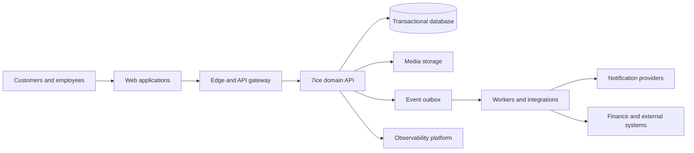

# Architecture

## Architectural style

7ice is a multi-tenant, modular platform with a web experience layer, a domain API, asynchronous integration processing, and managed data services. Modules are logical boundaries, not permission to duplicate customer, product, or work-order truth. A modular monolith is the default deployment unit until independently deployable services offer a measured operational advantage.

## Boundary rules

- Requests authenticate at the edge and authorize in the domain layer; never trust client-supplied tenant or role identifiers.
- Domain modules communicate through explicit interfaces and versioned events. The originating module owns write invariants.
- Transactional writes use an outbox so an accepted business event is not lost when downstream delivery fails.
- Read models may be optimized or eventually consistent, but must label freshness and never bypass authorization.

## Quality attributes

Availability, confidentiality, auditability, tenant isolation, and recoverability are first-class. Architectural work must meet [Security](./25_SECURITY.md), [Performance](./27_PERFORMANCE.md), [Deployment](./32_DEPLOYMENT.md), and [Testing](./33_TESTING.md).

## Key decisions

Identity is externally verifiable but application permissions remain policy-controlled. Relational transactional data is authoritative; analytics is derived. Record concrete technology choices in [ADRs](./39_ADR.md).
