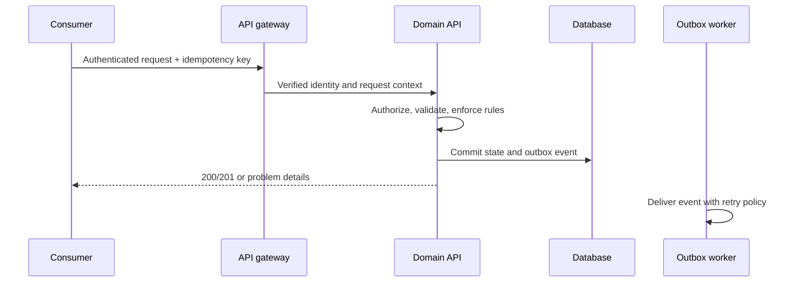

# API

## Contract principles

The 7ice API is versioned, tenant-safe, resource-oriented, and documented from executable contracts. It serves web clients and approved integrations; UI behavior is not an API contract. API changes follow [Release Strategy](./36_RELEASE_STRATEGY.md).

## Request lifecycle

## Standards

- Use HTTPS, JSON UTF-8, plural nouns, and stable opaque IDs. Accept and return ISO 8601 timestamps with offsets or UTC `Z`.
- Derive tenant and subject from the access token; never accept them as a trust boundary in request bodies.
- Use cursor pagination for large collections, explicit filtering and sorting, and documented maximum page sizes.
- Return RFC 9457-style problem details with a machine-readable code, safe message, and correlation ID.
- Require idempotency keys for externally retried create/command endpoints. Use `409` for resolvable version/state conflicts.

## Versioning and events

Additive changes are preferred. Deprecate with notice, usage telemetry, migration guidance, and a removal date. Events carry an immutable event ID, aggregate ID, tenant ID, schema version, occurred-at time, and minimal necessary payload. Consumers must deduplicate. See [Backend](./10_BACKEND.md), [Auth](./24_AUTH.md), and [Integrations](./31_INTEGRATIONS.md).
