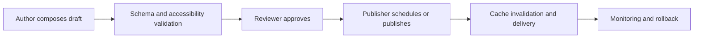

# Page Builder

## Purpose and boundaries

The page builder lets authorized content teams compose approved page sections from the design system. It accelerates marketing and editorial work while protecting brand, performance, security, and accessibility. It cannot inject arbitrary application code or alter protected conversion flows.

## Composition model

Pages use typed blocks with a validated schema: hero, rich content, media, feature list, call to action, comparison, FAQ, form embed, and approved campaign blocks. Blocks declare required content, responsive behavior, analytics events, SEO impact, and permissible variants. Nested free-form layout and arbitrary CSS are prohibited.

## Publication controls

Preview performs validation and identifies missing headings, alt text, invalid links, and over-budget media. Production uses immutable page revisions and cache-safe invalidation. See [CMS](./13_CMS.md), [Design System](./05_DESIGN_SYSTEM.md), [SEO](./26_SEO.md), and [Media Manager](./29_MEDIA_MANAGER.md).
