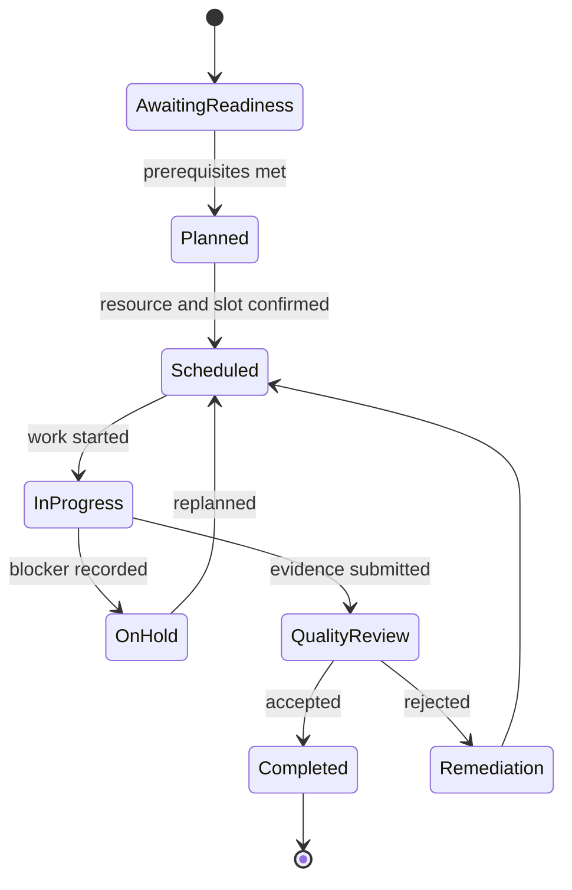

# Installations

## Purpose

Installations convert a confirmed commercial commitment into safe, schedulable, evidenced delivery. An installation is a managed work lifecycle linked to the customer, location, configuration snapshot, required skills, assets, documents, and billable milestones.

## Lifecycle

## Controls

Readiness validates site, permissions, product configuration, dependencies, safety requirements, and customer communication before scheduling. Assignment validates competence, capacity, geography, and conflict rules. Completion requires configured evidence, outcome codes, and quality acceptance; exceptions require an owner and next review date.

Customers receive appropriate progress through [Client Portal](./17_CLIENT_PORTAL.md) and [Notifications](./30_NOTIFICATIONS.md). Technicians act through [Employee Portal](./18_EMPLOYEE_PORTAL.md). Billable milestones are emitted for [Finance](./22_FINANCE.md) only after the authoritative lifecycle transition.
