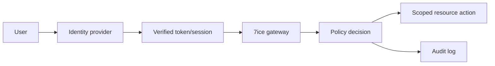

# Authentication and Authorization

## Model

7ice separates authentication (proving identity) from authorization (deciding whether an identity may act on a specific tenant resource). A standards-compliant identity provider issues verified sessions or tokens; the application resolves tenant membership, role, relationship, and policy at request time.

## Requirements

- Require MFA for administrators and high-risk employee roles; support step-up authentication for sensitive actions.
- Use short-lived access credentials, protected refresh/session handling, rotation, revocation, and device/session visibility.
- Implement least privilege with roles as coarse bundles and policies for tenant, ownership, relationship, and state constraints.
- Authorize every server-side resource access and background action. Never rely on hidden UI, client claims alone, or predictable IDs.
- Provision and deprovision users through auditable workflows; immediately revoke access on role removal or tenant membership removal.

Service identities use separate, narrowly scoped credentials and cannot impersonate end users without an explicitly audited support procedure. See [Security](./25_SECURITY.md), [Admin Panel](./16_ADMIN_PANEL.md), [Client Portal](./17_CLIENT_PORTAL.md), and [API](./12_API.md).
