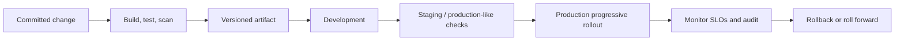

# Deployment and Operations

## Delivery model

Infrastructure and application configuration are defined as code, reviewed, and promoted through isolated environments. A build artifact is created once, signed or attested, scanned, and promoted unchanged from test to production. Environment differences are configuration, not branches.

## Requirements

- Separate development, test, staging, and production accounts/projects; production data never enters lower environments without approved minimization.
- Inject environment configuration and secrets at runtime from approved stores. Validate configuration and use least-privilege workload identities.
- Use health checks, readiness gates, feature flags, canary or progressive delivery, and a tested rollback route.
- Run backups, point-in-time recovery where applicable, restore drills, disaster-recovery exercises, and dependency failover tests.
- Maintain runbooks, on-call ownership, alert routing, dashboard links, and change records for production operations.

Database evolution follows [Database](./11_DATABASE.md), security controls [Security](./25_SECURITY.md), reliability [Performance](./27_PERFORMANCE.md), and release controls [Release Strategy](./36_RELEASE_STRATEGY.md).
